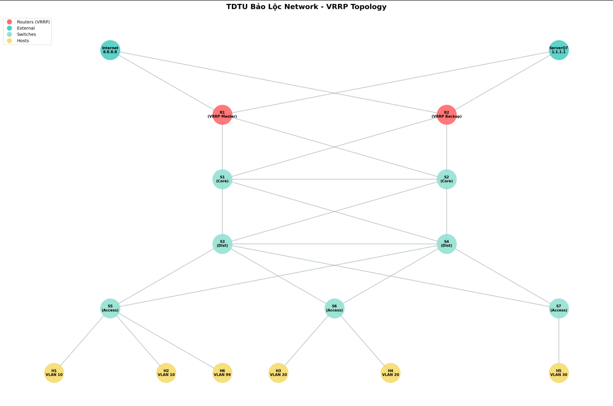

# VRRP Network Simulation with Traffic Testing & Load Balancing

Mô phỏng mạng VRRP với khả năng failover tự động, test nghẽn băng thông và cân bằng tải ECMP.

---

## 📋 Mục Lục

1. [Tổng Quan](#tổng-quan)
2. [Yêu Cầu Hệ Thống](#yêu-cầu-hệ-thống)
3. [Cài Đặt](#cài-đặt)
4. [Kiến Trúc Mạng](#kiến-trúc-mạng)
5. [Chạy Simulation](#chạy-simulation)
6. [Test Menu](#test-menu)
7. [VRRP Failover](#vrrp-failover)
8. [Troubleshooting](#troubleshooting)

---

## 🎯 Tổng Quan

Project này triển khai một mạng doanh nghiệp hoàn chỉnh với:

- **VRRP (Virtual Router Redundancy Protocol)**: Failover tự động khi router chính (R1) down
- **STP (Spanning Tree Protocol)**: Chống loop layer 2
- **VLAN**: Phân đoạn mạng (VLAN 10, 20, 30)
- **ECMP Load Balancing**: Cân bằng tải qua nhiều đường đi
- **Traffic Testing**: Công cụ test nghẽn mạng với công thức bandwidth

---

## 💻 Yêu Cầu Hệ Thống

### Phần Mềm:
- **Mininet** >= 2.3.0
- **Python** >= 3.6
- **iperf** (traffic generator)
- **iproute2** (ip command tools)

### Tài Nguyên:
- RAM: >= 2GB
- CPU: >= 2 cores
- Disk: >= 500MB free space

---

## 🔧 Cài Đặt

### 1. Cài Đặt Mininet

```bash
# Ubuntu/Debian
sudo apt-get update
sudo apt-get install mininet

# Hoặc cài từ source
git clone https://github.com/mininet/mininet
cd mininet
sudo ./util/install.sh -a
```

### 2. Cài Đặt Dependencies

```bash
# Cài iperf
sudo apt-get install iperf

# Cài Python packages
sudo apt-get install python3-matplotlib python3-networkx

# Hoặc dùng pip
pip3 install matplotlib networkx
```

### 3. Clone Project

```bash

```

### 4. Cấu Trúc Files

```
bai3/
├── cauhinh.py           # Main simulation script
├── vrrp_monitor.py      # VRRP failover daemon
├── test_menu.py         # Traffic testing menu
├── debai.txt           # Đề bài/requirements
└── README.md           # File này
```

---

## 🏗️ Kiến Trúc Mạng

### Topology




### IP Addressing

| Device | Interface | IP Address | VLAN | Purpose |
|--------|-----------|------------|------|---------|
| R1 | eth0 | 192.168.10.1/24 | 10 | VLAN 10 Gateway |
| R1 | eth1 | 192.168.20.1/24 | 20 | VLAN 20 Gateway |
| R1 | eth2 | 8.8.8.1/24 | - | Internet Link |
| R1 | eth3 | 1.1.1.2/24 | - | ServerQ7 Link |
| R2 | eth0 | 192.168.10.2/24 | 10 | VLAN 10 Backup |
| R2 | eth1 | 192.168.20.2/24 | 20 | VLAN 20 Backup |
| VIP | - | 192.168.0.254 | - | Virtual IP (VRRP) |
| Internet | - | 8.8.8.8 | - | External Server |
| ServerQ7 | - | 1.1.1.1 | - | Internal Server |

### Link Capacity

- **Internet (R1-eth2)**: 1000 Mbps
- **ServerQ7 (R1-eth3)**: 500 Mbps
- **Internal Links**: 1000 Mbps

---

## 🚀 Chạy Simulation

### Chạy Cơ Bản

```bash
cd /home/mn/mininet-wifi/examples/bai3
sudo python3 cauhinh.py
```

### Khi Khởi Động Thành Công

Bạn sẽ thấy:

```
*** VRRP Network Simulation ***
[TOPOLOGY] Network topology visualization saved
[VRRP] Monitoring thread started
[INFO] R1 is MASTER - VIPs active
[INFO] R2 is BACKUP - Waiting for failover

*** Entering CLI Mode ***
*** Test Menu Available: type 'test' to start ***
mininet>
```

---

## 🧪 Test Menu

### Vào Test Menu

```bash
mininet> test
```

### Danh Sách Chức Năng

```
============================================================
          MENU TEST TRAFFIC & LOAD BALANCING
============================================================
1. Test Nghẽn Băng Thông đến Internet
2. Test Nghẽn Băng Thông đến ServerQ7
3. Test Nghẽn Toàn Bộ Mạng
4. Cấu Hình Load Balancing cho R1 & R2
5. Kiểm Tra Trạng Thái Load Balancing
6. 🎯 DEMO: So Sánh Trước/Sau Load Balancing
7. Dừng Test Traffic
8. Hiển Thị Thống Kê Traffic
0. Thoát Menu
============================================================
```

### Chi Tiết Các Option

#### **Option 1: Test Internet**

Test nghẽn đường Internet (1000 Mbps):

```
Công thức: Total_Traffic = 6 hosts × 100 Mbps = 600 Mbps
Expected: OK (600 < 1000)
```

**Output mẫu:**
```
Starting iperf server on Internet (8.8.8.8)...
Traffic test running for 15 seconds...

R1-eth2 (to Internet) statistics:
        TX packets 583513  bytes 882241466 (882.2 MB)

Iperf server report:
[  1] 0.0-15.0 sec  80.5 MBytes  45.0 Mbits/sec  0% packet loss
```

#### **Option 2: Test ServerQ7**

Test nghẽn đường ServerQ7 (500 Mbps):

```
Công thức: Total_Traffic = 6 hosts × 100 Mbps = 600 Mbps
Expected: CONGEST (600 > 500)
```

**Output mẫu:**
```
Link ServerQ7: 500 Mbps (WARNING: 600 > 500 - WILL CONGEST!)

Iperf server report (check packet loss!):
[  1] 0.0-15.0 sec  45.2 MBytes  25.3 Mbits/sec  37% packet loss ⚠️
```

#### **Option 4: Cấu Hình Load Balancing**

Cấu hình ECMP multipath routing:

```
Configuring ECMP (Equal-Cost Multi-Path) routes...

R1 multipath route:
default 
    nexthop via 8.8.8.8 dev r1-eth2 weight 1 
    nexthop via 1.1.1.1 dev r1-eth3 weight 1 

LOAD BALANCING CONFIGURED!
Total bandwidth: 1000 + 500 = 1500 Mbps
```

#### **Option 6: 🎯 DEMO Before/After**

So sánh hiệu quả load balancing:

**PHASE 1 (Before)**: Single path → Nghẽn
**PHASE 2 (After)**: Multipath ECMP → OK

**Output mẫu:**
```
📈 SUMMARY COMPARISON
======================================================================
Metric                         BEFORE LB            AFTER LB
----------------------------------------------------------------------
Total Traffic:                 240 Mbps             240 Mbps
Available Capacity:            500 Mbps             1500 Mbps
Actual Packet Loss:            15.2%                2.3%
Improvement:                   -                    85% reduction
======================================================================

🎓 CONCLUSION:
   ✅ Load Balancing SUCCESSFULLY reduced congestion!
```

---

## 🔄 VRRP Failover

### Kiểm Tra Trạng Thái VRRP

```bash
mininet> r1 ip addr show r1-eth0
# Kiểm tra VIP 192.168.10.254 có trên R1 không

mininet> r2 ip addr show r2-eth0
# VIP không có trên R2 khi R1 còn sống
```

### Test Failover (R1 Down)

#### Bước 1: Shutdown R1

```bash
mininet> sh ifconfig r1-eth0 down
mininet> sh ifconfig r1-eth1 down
```

#### Bước 2: Quan Sát

Trong vòng 3-5 giây, bạn sẽ thấy output:

```
[VRRP] !!! R1 is DOWN - Initiating failover !!!
[VRRP] + Adding VIP 192.168.10.254 to R2-eth0
[VRRP] + Adding VIP 192.168.20.254 to R2-eth1
[VRRP] + Updated Internet default route to R2 (8.8.8.2 via eth1)
[VRRP] + Updated ServerQ7 default route to R2 (1.1.1.3 via eth1)
[VRRP] === FAILOVER COMPLETE - R2 is now MASTER ===
```

#### Bước 3: Kiểm Tra Kết Nối

```bash
mininet> h1 ping -c 3 8.8.8.8
# Traffic bây giờ đi qua R2
```

### Test Failback (R1 Recovery)

#### Bước 1: Khôi Phục R1

```bash
mininet> sh ifconfig r1-eth0 up
mininet> sh ifconfig r1-eth1 up
```

#### Bước 2: Quan Sát

```
[VRRP] !!! R1 is BACK - Initiating failback !!!
[VRRP] + Removing VIP 192.168.10.254 from R2-eth0
[VRRP] + Removing VIP 192.168.20.254 from R2-eth1
[VRRP] + Restored Internet default route to R1 (8.8.8.1 via eth0)
[VRRP] === FAILBACK COMPLETE - R1 is MASTER again ===
```

---

## 🧮 Công Thức Tính Bandwidth

### Công Thức Cơ Bản

```
Total_Traffic = Number_of_Hosts × Required_Bandwidth
```

### Ví Dụ

| Hosts | BW/host | Total Traffic | Link Capacity | Result |
|-------|---------|---------------|---------------|--------|
| 6 | 100 Mbps | 600 Mbps | 1000 Mbps (Internet) | ✅ OK |
| 6 | 100 Mbps | 600 Mbps | 500 Mbps (ServerQ7) | ⚠️ CONGEST |
| 6 | 40 Mbps | 240 Mbps | 500 Mbps | ✅ OK |
| 6 | 200 Mbps | 1200 Mbps | 1500 Mbps (LB) | ✅ OK |

### Capacity Planning

**Không có Load Balancing:**
- Available: 500 Mbps (ServerQ7 only)
- Safe traffic: < 400 Mbps (80% utilization)

**Với Load Balancing:**
- Available: 1500 Mbps (1000 + 500)
- Safe traffic: < 1200 Mbps (80% utilization)

---

## 📊 Monitoring & Debugging

### Kiểm Tra Routes

```bash
# R1 routing table
mininet> r1 ip route show

# R2 routing table
mininet> r2 ip route show
```

### Kiểm Tra Traffic Stats

```bash
# Interface statistics
mininet> r1 ifconfig r1-eth2

# Network statistics
mininet> r1 netstat -i
```

### Xem VRRP Status

```bash
# Kiểm tra VIP trên R1
mininet> r1 ip addr | grep 192.168

# Kiểm tra process
mininet> sh ps aux | grep vrrp
```

### Xem Iperf Logs

```bash
# Internet traffic log
mininet> internet cat /tmp/iperf_internet.log

# ServerQ7 traffic log
mininet> serverq7 cat /tmp/iperf_serverq7.log
```

---

## 🐛 Troubleshooting

### Vấn Đề 1: VRRP Không Failover

**Triệu chứng**: R1 down nhưng R2 không nhận VIP

**Giải pháp**:
```bash
# Kiểm tra vrrp_monitor có chạy không
mininet> sh ps aux | grep vrrp_monitor

# Restart Mininet nếu cần
mininet> exit
sudo python3 cauhinh.py
```

### Vấn Đề 2: Packet Loss Cao Bất Thường

**Triệu chứng**: Packet loss >30% ngay cả khi bandwidth đủ

**Nguyên nhân**: CPU bottleneck trong Mininet

**Giải pháp**:
```python
# Sửa trong test_menu.py, dòng 255
bandwidth_per_host = 30  # Giảm từ 40 xuống 30
```

### Vấn Đề 3: Hosts Không Ping Được

**Kiểm tra**:
```bash
# 1. Kiểm tra interface
mininet> h1 ifconfig

# 2. Kiểm tra gateway
mininet> h1 ip route

# 3. Ping gateway
mininet> h1 ping -c 3 192.168.10.254

# 4. Ping router
mininet> h1 ping -c 3 192.168.10.1
```

### Vấn Đề 4: Load Balancing Không Hoạt Động

**Kiểm tra ECMP routes**:
```bash
mininet> r1 ip route show default

# Phải thấy:
# default 
#     nexthop via 8.8.8.8 dev r1-eth2 weight 1 
#     nexthop via 1.1.1.1 dev r1-eth3 weight 1
```

**Fix nếu thiếu**:
```bash
mininet> test
# Chọn option 4 để cấu hình lại
```

### Vấn Đề 5: Test Menu Không Mở

**Triệu chứng**: Gõ `test` không có phản ứng

**Kiểm tra**:
```bash
# Xem test_menu.py có import được không
mininet> py import test_menu

# Nếu lỗi, kiểm tra syntax
cd /home/mn/mininet-wifi/examples/bai3
python3 -m py_compile test_menu.py
```

---

## 📝 Các Lệnh CLI Hữu Ích

### Trong Mininet CLI

```bash
# Ping test
mininet> pingall             # Ping all hosts
mininet> h1 ping h2          # Ping specific host
mininet> h1 ping 8.8.8.8     # Ping external

# Bandwidth test
mininet> iperf h1 h2         # TCP iperf
mininet> iperf h1 h2 -u      # UDP iperf

# Network commands
mininet> dump                # Show network info
mininet> net                 # Show topology
mininet> links               # Show links status

# Node commands
mininet> nodes               # List all nodes
mininet> h1 ip addr          # Run command on h1
mininet> r1 ip route         # Show R1 routes

# Test menu
mininet> test                # Open traffic test menu
mininet> congestion internet # Quick congestion test
mininet> loadbal             # Quick load balancing
mininet> stats               # Quick traffic stats

# Exit
mininet> exit                # Clean exit
```

---

## 📚 Tài Liệu Tham Khảo

### Files Hướng Dẫn Chi Tiết

1. **huongdan_test_menu.md**: Chi tiết về test menu và các options
2. **demo_load_balancing.md**: Hướng dẫn demo load balancing before/after
3. **vrrp_fixes_summary.md**: Tóm tắt các fixes cho VRRP failover

### Công Nghệ Sử Dụng

- [Mininet Documentation](http://mininet.org/)
- [VRRP Protocol RFC 3768](https://tools.ietf.org/html/rfc3768)
- [Linux ECMP Routing](https://docs.kernel.org/networking/multipath-routing.html)
- [iperf Documentation](https://iperf.fr/iperf-doc.php)

---

## 🎓 Learning Objectives

Sau khi hoàn thành lab này, bạn sẽ hiểu:

1. ✅ VRRP failover mechanism
2. ✅ STP loop prevention
3. ✅ VLAN configuration và inter-VLAN routing
4. ✅ ECMP load balancing
5. ✅ Bandwidth capacity planning
6. ✅ Network congestion analysis
7. ✅ Mininet network simulation
