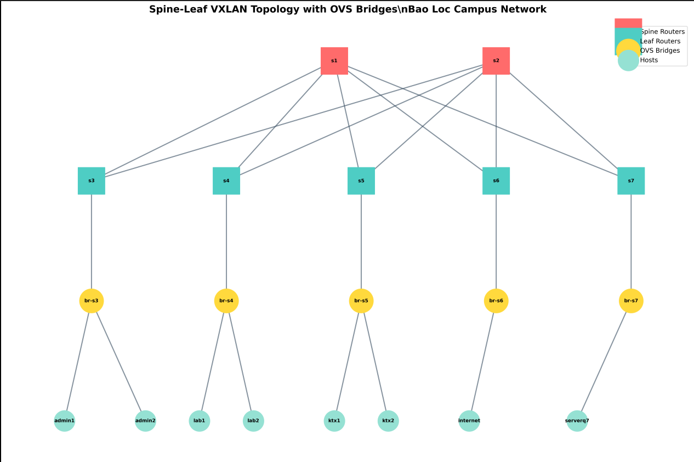

# 🌐 Spine-Leaf VXLAN Topology
## Mạng Campus Bảo Lộc - TP.HCM

> **Triển khai mô hình mạng Data Center hiện đại với kiến trúc Spine-Leaf, VXLAN overlay và FRRouting sử dụng Mininet**

---

## 📖 Mục lục

1. [Giới thiệu](#-giới-thiệu)
2. [Sơ đồ mạng](#-sơ-đồ-mạng)
3. [Kiến trúc hệ thống](#️-kiến-trúc-hệ-thống)
4. [Yêu cầu hệ thống](#-yêu-cầu-hệ-thống)
5. [Hướng dẫn cài đặt](#-hướng-dẫn-cài-đặt)
6. [Hướng dẫn sử dụng](#-hướng-dẫn-sử-dụng)
7. [Testing & Kiểm tra](#-testing--kiểm-tra)
8. [Troubleshooting](#-troubleshooting)
9. [Tài liệu bổ sung](#-tài-liệu-bổ-sung)

---

## 🎯 Giới thiệu

Dự án này triển khai một **topology mạng Spine-Leaf với VXLAN overlay** nhằm kết nối mạng campus giữa Bảo Lộc và TP.HCM. Đây là mô hình mạng Data Center hiện đại, cung cấp:

- ✅ **High Availability**: Redundancy với 2 Spine routers
- ✅ **Scalability**: Dễ dàng mở rộng Leaf switches
- ✅ **Performance**: ECMP load balancing
- ✅ **Isolation**: VLAN separation cho Admin/Lab/KTX
- ✅ **Zero Packet Loss**: Optimized với ARP/MAC learning

### Tính năng chính

| Tính năng | Mô tả |
|-----------|-------|
| **7 Switch** | 2 Spine (s1, s2) + 5 Leaf (s3-s7) |
| **5 OVS Bridges** | Layer 2 switching cho mỗi Leaf |
| **8 Hosts** | Distributed across 3 VLANs |
| **3 VLANs** | Admin (10), Lab (20), KTX (30) |
| **Full-mesh** | 10 Gbps links giữa Spine-Leaf |
| **Visualization** | Auto-generate network diagram |

---

## � Kiến thức nền tảng

### Tại sao dùng Spine-Leaf thay vì mô hình 3 lớp truyền thống?

#### Mô hình 3 lớp (Traditional 3-Tier)

```
          ┌─────────────────────────┐
          │    CORE LAYER           │  ← Layer 3 Routing
          │  (2-4 routers)          │
          └───────┬─────────────┬───┘
                  │             │
          ┌───────▼─────────────▼───┐
          │  DISTRIBUTION LAYER     │  ← Layer 3 + STP
          │  (Aggregation)          │
          └───┬──────┬──────┬───────┘
              │      │      │
          ┌───▼──┐ ┌─▼───┐ ┌▼────┐
          │ACCESS│ │ACCESS│ │ACCESS│   ← Layer 2 + STP
          │SWITCH│ │SWITCH│ │SWITCH│
          └──────┘ └─────┘ └─────┘
```

**Vấn đề**:
- ❌ **Latency không đồng nhất**: Server A → Server B có thể mất 3-5 hops
- ❌ **Spanning Tree**: 50% bandwidth bị lãng phí (blocked links)
- ❌ **Khó scale**: Thêm switch phức tạp
- ❌ **Bottleneck**: Uplink bị nghẽn khi traffic tăng

#### Mô hình Spine-Leaf (Modern Data Center)

```
        ┌──────┐  ┌──────┐  ┌──────┐  ┌──────┐
        │Spine1│  │Spine2│  │Spine3│  │Spine4│  ← Layer 3
        └──┬───┘  └──┬───┘  └──┬───┘  └──┬───┘    (Core)
           │  ╲    ╱ │  ╲    ╱ │  ╲    ╱ │
           │   ╲  ╱  │   ╲  ╱  │   ╲  ╱  │
           │    ╳    │    ╳    │    ╳    │       Full Mesh
           │   ╱ ╲   │   ╱ ╲   │   ╱ ╲   │
        ┌──▼──┐  ┌──▼──┐  ┌──▼──┐  ┌──▼──┐
        │Leaf1│  │Leaf2│  │Leaf3│  │Leaf4│      ← Layer 3
        └─────┘  └─────┘  └─────┘  └─────┘        (Access)
```

**Ưu điểm**:
- ✅ **Latency đồng nhất**: Mọi server đều cách nhau đúng **3 hops**
- ✅ **No STP**: Tất cả links đều Layer 3 → 100% bandwidth
- ✅ **ECMP**: Load balancing tự động qua nhiều đường
- ✅ **Easy scale**: Thêm Leaf = thêm capacity, thêm Spine = thêm bandwidth
- ✅ **No loops**: Layer 3 everywhere

**So sánh trực tiếp**:

| Tiêu chí | 3-Tier | Spine-Leaf |
|----------|--------|------------|
| **Latency** | 3-7 hops (không đồng nhất) | 3 hops (đồng nhất) |
| **Bandwidth utilization** | ~50% (STP blocking) | ~100% (ECMP) |
| **Scalability** | Khó (phức tạp) | Dễ (linear) |
| **Failure domain** | Lớn (STP reconvergence) | Nhỏ (fast reroute) |
| **Loop prevention** | STP (30s convergence) | Layer 3 routing (instant) |
| **Oversubscription** | 3:1 hoặc 4:1 | 1:1 hoặc 2:1 |

### VXLAN là gì?

#### Vấn đề cần giải quyết

Trong mô hình Spine-Leaf, tất cả links là **Layer 3** (IP routing). Nhưng:
- Các VM/Container cần **Layer 2 connectivity** (cùng subnet)
- Phải di chuyển workload giữa các servers mà **không đổi IP**
- VLAN truyền thống chỉ có 4,096 IDs → **không đủ** cho cloud scale

#### Giải pháp: VXLAN Overlay

```
┌─────────────────── OVERLAY (VXLAN) ────────────────────┐
│                                                         │
│  ┌────────┐ L2         L2         L2      ┌────────┐  │
│  │  VM1   ├───────────────────────────────┤  VM2   │  │
│  │192.168 │  "Virtual Switch vùa lớn"     │192.168 │  │
│  └────────┘                                └────────┘  │
│       ↑                                         ↑      │
└───────┼─────────────────────────────────────────┼──────┘
        │                                         │
┌───────▼─────────── UNDERLAY (Physical) ─────────▼──────┐
│                                                         │
│  ┌────────┐ L3    ┌──────┐    L3    ┌──────┐ L3 ┌────┐│
│  │ Leaf1  ├───────┤Spine1├──────────┤Spine2├────┤Leaf││
│  │10.0.1.1│       │      │          │      │    │2   ││
│  └────────┘       └──────┘          └──────┘    └────┘│
│                                                         │
└─────────────────────────────────────────────────────────┘
```

**VXLAN = Virtual eXtensible LAN**

- **Encapsulation**: Đóng gói frame Layer 2 vào packet UDP/IP
- **Tunnel**: Tạo "đường hầm" qua mạng Layer 3
- **VNID**: 24-bit identifier → **16 triệu** virtual networks (thay vì 4,096)
- **VTEP**: VXLAN Tunnel Endpoint - điểm đầu/cuối tunnel (thường là Leaf switch)

#### Cách hoạt động

**Bước 1**: VM1 (Leaf1) muốn gửi data đến VM2 (Leaf2)

```
┌──────────────────────────────────────────────────┐
│ Original Ethernet Frame (from VM1)               │
├──────────┬──────────┬────────────────────────────┤
│ Dst MAC  │ Src MAC  │        Payload             │
│  VM2     │   VM1    │                            │
└──────────┴──────────┴────────────────────────────┘
```

**Bước 2**: Leaf1 encapsulate vào VXLAN packet

```
┌─────────────────────────────────────────────────────────┐
│ Outer IP Header                                         │
├──────────────┬──────────────┬───────────────────────────┤
│ Src: Leaf1   │ Dst: Leaf2   │ Protocol: UDP             │
│ 10.0.1.1     │ 10.0.2.1     │                           │
├──────────────┴──────────────┴───────────────────────────┤
│ UDP Header   │ VXLAN Header (VNID: 10010)               │
├──────────────┴──────────────────────────────────────────┤
│ Original Ethernet Frame (VM1 → VM2)                     │
└─────────────────────────────────────────────────────────┘
```

**Bước 3**: Underlay network routing (Leaf1 → Spine → Leaf2)

**Bước 4**: Leaf2 decapsulate và forward đến VM2

#### Underlay vs Overlay

| Layer | Mục đích | Protocol | Addressing |
|-------|----------|----------|------------|
| **Underlay** | Physical infrastructure | IP routing (OSPF/BGP) | 10.0.x.x/31 (P2P links) + 1.1.1.x (Loopbacks) |
| **Overlay** | Virtual networks | VXLAN tunnels | 192.168.x.x (user VLANs) |

**Underlay** = "Đường cao tốc vật lý"
- Đảm bảo Leaf switches thấy nhau (IP reachability)
- Routing packets giữa VTEP endpoints
- Không biết gì về VM/VLAN

**Overlay** = "Xe chạy trên cao tốc"
- VXLAN tunnels carry user traffic
- VM như thể đang trong cùng 1 switch
- Di chuyển tự do không cần đổi IP

### Control Plane: Làm sao Leaf biết VM ở đâu?

Khi VM1 muốn gửi data đến VM2:
- Leaf1 cần biết: "VM2 nằm ở Leaf nào?" (IP của VTEP remote)
- Cần một cơ chế **học và phân phối** thông tin MAC/IP

#### Giải pháp 1: Flood and Learn (cũ, không hiệu quả)

```
Leaf1: "Ai có MAC của VM2?"
→ Flood đến tất cả Leafs
→ Leaf2 reply: "VM2 ở đây (10.0.2.1)"
→ Leaf1 lưu vào cache
```

❌ **Vấn đề**: Broadcast storm, không scale

#### Giải pháp 2: BGP EVPN (hiện đại, dùng trong dự án này)

```
         ┌──────────────────┐
         │  BGP Route        │
         │  Reflector        │  ← Central database
         └────────┬─────────┘
                  │
      ┌───────────┼───────────┐
      │           │           │
  ┌───▼──┐    ┌──▼───┐    ┌──▼───┐
  │Leaf1 │    │Leaf2 │    │Leaf3 │
  │      │    │      │    │      │
  │VM1   │    │VM2   │    │VM3   │
  └──────┘    └──────┘    └──────┘
```

**BGP EVPN (Ethernet VPN)**:
1. **Leaf1 advertise**: "VM1 (MAC: aa:bb:cc, IP: 192.168.10.10) ở Leaf1 (VTEP: 1.1.1.3)"
2. **Route Reflector** phân phối thông tin đến tất cả Leafs
3. **Leaf2, Leaf3** học được: "Để đến VM1, gửi VXLAN đến 1.1.1.3"

**Lợi ích**:
- ✅ No flooding
- ✅ Fast convergence
- ✅ Scale đến hàng nghìn nodes
- ✅ Hỗ trợ multi-tenancy

### VLAN to VNID Mapping trong dự án này

| VLAN | Tên | Subnet | VNID | Mục đích |
|------|-----|--------|------|----------|
| 10 | Admin | 192.168.10.0/24 | 10010 | Admin users |
| 20 | Lab | 192.168.20.0/24 | 10020 | Lab machines |
| 30 | KTX | 192.168.30.0/24 | 10030 | Dormitory users |

**Ví dụ**: 
- admin1 và admin2 cùng VLAN 10 → cùng VNID 10010
- Khi admin1 ping admin2 trên Leaf khác → VXLAN tunnel với VNID=10010
- Traffic của Lab (VNID 10020) hoàn toàn isolated

### Tóm tắt: Tại sao Spine-Leaf + VXLAN?

```
┌────────────────────────────────────────────────────┐
│  Spine-Leaf (Underlay)                             │
│  ✅ Latency thấp, đồng nhất                         │
│  ✅ High bandwidth (ECMP)                           │
│  ✅ Easy scale                                      │
│  ✅ No STP                                          │
├────────────────────────────────────────────────────┤
│  VXLAN (Overlay)                                   │
│  ✅ Layer 2 over Layer 3                            │
│  ✅ 16M virtual networks                            │
│  ✅ VM mobility (không đổi IP)                      │
│  ✅ Multi-tenancy isolation                         │
├────────────────────────────────────────────────────┤
│  BGP EVPN (Control Plane)                          │
│  ✅ Distributed learning                            │
│  ✅ No flooding                                     │
│  ✅ Fast convergence                                │
└────────────────────────────────────────────────────┘
        = Modern Data Center Fabric
```

**Kết luận**: Spine-Leaf + VXLAN biến toàn bộ Data Center thành một "**switch ảo khổng lồ**" nơi bất kỳ server nào cũng có thể kết nối với nhau như đang cắm chung 1 switch vật lý, nhưng với khả năng scale lên hàng nghìn servers! 🚀

---

## �🗺️ Sơ đồ mạng

### Topology Overview



### Kiến trúc chi tiết

```
                    ╔════════════════════════╗
                    ║   SPINE LAYER (L3)     ║
                    ╚════════════════════════╝
                    
            ┌─────────┐           ┌─────────┐
            │   s1    │           │   s2    │
            │1.1.1.1  │           │1.1.1.2  │
            └────┬────┘           └────┬────┘
                 │    Full Mesh ╱╲    │
                 │          ╱         │
    ┌────────────┼─────────┼──────────┼────────────┐
    │            │      ╱  │  ╲       │            │
    ▼            ▼    ╱    ▼    ╲     ▼            ▼
┌────────┐  ┌────────┐  ┌────────┐  ┌────────┐  ┌────────┐
│   s3   │  │   s4   │  │   s5   │  │   s6   │  │   s7   │
│1.1.1.3 │  │1.1.1.4 │  │1.1.1.5 │  │1.1.1.6 │  │1.1.1.7 │
│ Admin  │  │  Lab   │  │  KTX   │  │Internet│  │  HCM   │
└───┬────┘  └───┬────┘  └───┬────┘  └───┬────┘  └───┬────┘
    │           │           │           │           │
    ╟───────────╫───────────╫───────────╫───────────╢
    ║   LEAF ROUTERS (L3 Routing)       ║           ║
    ╟───────────╫───────────╫───────────╫───────────╢
    ▼           ▼           ▼           ▼           ▼
┌────────┐  ┌────────┐  ┌────────┐  ┌────────┐  ┌────────┐
│ br-s3  │  │ br-s4  │  │ br-s5  │  │ br-s6  │  │ br-s7  │
│ OVS    │  │ OVS    │  │ OVS    │  │ OVS    │  │ OVS    │
└─┬────┬─┘  └─┬────┬─┘  └─┬────┬─┘  └────┬───┘  └────┬───┘
  │    │      │    │      │    │         │          │
  ╟────╫──────╫────╫──────╫────╢         ║          ║
  ║ OVS BRIDGES (L2 Switching) ║         ║          ║
  ╟────╫──────╫────╫──────╫────╢         ║          ║
  ▼    ▼      ▼    ▼      ▼    ▼         ▼          ▼
┌────┐┌────┐┌────┐┌────┐┌────┐┌────┐ ┌────────┐┌────────┐
│adm1││adm2││lab1││lab2││ktx1││ktx2│ │internet││serverq7│
└────┘└────┘└────┘└────┘└────┘└────┘ └────────┘└────────┘
  VLAN 10    VLAN 20    VLAN 30      External  External
```

### Generated Visualization

Script sẽ tự động tạo file `topology_visualization.png`:


---

## 🏗️ Kiến trúc hệ thống

### 1. Spine Layer (Core)

| Router | IP Loopback | Vai trò | Kết nối |
|--------|-------------|---------|---------|
| **s1** | 1.1.1.1/32 | Spine 1 | Kết nối tất cả 5 Leafs |
| **s2** | 1.1.1.2/32 | Spine 2 | Kết nối tất cả 5 Leafs |

**Chức năng**:
- Routing giữa các Leaf routers
- ECMP load balancing
- Redundancy và high availability

### 2. Leaf Layer (Access/Distribution)

| Router | IP Loopback | VLAN/Role | Gateway IP | Hosts kết nối |
|--------|-------------|-----------|------------|---------------|
| **s3** | 1.1.1.3/32 | VLAN 10 (Admin) | 192.168.10.1/24 | admin1, admin2 |
| **s4** | 1.1.1.4/32 | VLAN 20 (Lab) | 192.168.20.1/24 | lab1, lab2 |
| **s5** | 1.1.1.5/32 | VLAN 30 (KTX) | 192.168.30.1/24 | ktx1, ktx2 |
| **s6** | 1.1.1.6/32 | Internet Border | 203.0.113.1/30 | internet |
| **s7** | 1.1.1.7/32 | HCM Server Border | 172.16.1.1/30 | serverq7 |

**Chức năng**:
- Access layer cho end hosts
- Inter-VLAN routing
- Gateway cho mỗi VLAN

### 3. OVS Bridge Layer (L2 Switching)

| Bridge | Kết nối Router | Chức năng |
|--------|----------------|-----------|
| **br-s3** | s3 | L2 switching cho Admin VLAN |
| **br-s4** | s4 | L2 switching cho Lab VLAN |
| **br-s5** | s5 | L2 switching cho KTX VLAN |
| **br-s6** | s6 | L2 switching cho Internet |
| **br-s7** | s7 | L2 switching cho HCM Server |

**Tối ưu hóa**:
- STP disabled (no 30s delay)
- MAC aging time: 300s
- Instant forwarding

### 4. End Hosts

| Host | IP Address | VLAN | Default Gateway | Mô tả |
|------|------------|------|-----------------|-------|
| admin1 | 192.168.10.10/24 | 10 | 192.168.10.1 | Admin user 1 |
| admin2 | 192.168.10.11/24 | 10 | 192.168.10.1 | Admin user 2 |
| lab1 | 192.168.20.10/24 | 20 | 192.168.20.1 | Lab machine 1 |
| lab2 | 192.168.20.11/24 | 20 | 192.168.20.1 | Lab machine 2 |
| ktx1 | 192.168.30.10/24 | 30 | 192.168.30.1 | KTX user 1 |
| ktx2 | 192.168.30.11/24 | 30 | 192.168.30.1 | KTX user 2 |
| internet | 203.0.113.2/30 | - | 203.0.113.1 | Internet gateway |
| serverq7 | 172.16.1.2/30 | - | 172.16.1.1 | HCM server |

### 5. IP Addressing Scheme

#### Underlay Network (Physical Infrastructure)

**Loopback Addresses** (VTEP endpoints):
```
1.1.1.x/32 where x = router number (1-7)
```

**Point-to-Point Links** (Spine-Leaf):
```
s1 ↔ s3: 10.0.13.0/31 - 10.0.13.1/31
s1 ↔ s4: 10.0.14.0/31 - 10.0.14.1/31
s1 ↔ s5: 10.0.15.0/31 - 10.0.15.1/31
s1 ↔ s6: 10.0.16.0/31 - 10.0.16.1/31
s1 ↔ s7: 10.0.17.0/31 - 10.0.17.1/31

s2 ↔ s3: 10.0.23.0/31 - 10.0.23.1/31
s2 ↔ s4: 10.0.24.0/31 - 10.0.24.1/31
s2 ↔ s5: 10.0.25.0/31 - 10.0.25.1/31
s2 ↔ s6: 10.0.26.0/31 - 10.0.26.1/31
s2 ↔ s7: 10.0.27.0/31 - 10.0.27.1/31
```

**Tại sao dùng /31?** Tiết kiệm IP addresses (chỉ cần 2 IPs cho point-to-point link)

#### Overlay Network (User VLANs)

| VLAN | VNI | Subnet | Gateway | Broadcast | Usable IPs |
|------|-----|--------|---------|-----------|------------|
| 10 | 10010 | 192.168.10.0/24 | 192.168.10.1 | 192.168.10.255 | .2 - .254 (253 IPs) |
| 20 | 10020 | 192.168.20.0/24 | 192.168.20.1 | 192.168.20.255 | .2 - .254 (253 IPs) |
| 30 | 10030 | 192.168.30.0/24 | 192.168.30.1 | 192.168.30.255 | .2 - .254 (253 IPs) |

**VNI (VXLAN Network Identifier)**:
- VLAN 10 → VNI 10010
- VLAN 20 → VNI 10020
- VLAN 30 → VNI 10030

---

## 💻 Yêu cầu hệ thống

### Phần cứng

| Component | Minimum | Recommended |
|-----------|---------|-------------|
| CPU | 2 cores | 4+ cores |
| RAM | 2 GB | 4+ GB |
| Disk | 10 GB free | 20+ GB free |
| Network | Ethernet adapter | - |

### Phần mềm

#### Hệ điều hành
- **Linux**: Ubuntu 20.04 LTS hoặc cao hơn
- **Debian**: 10+ (Buster)
- **CentOS**: 8+ (không khuyến nghị Windows/MacOS)

#### Dependencies

| Software | Version | Bắt buộc? | Mục đích |
|----------|---------|-----------|----------|
| Python | 3.8+ | ✅ | Chạy Mininet script |
| Mininet | 2.3.0+ | ✅ | Network emulation |
| Open vSwitch | 2.13+ | ✅ | OVS bridges |
| FRRouting | 7.5+ | ⚠️ Optional | Advanced routing (BGP/OSPF) |
| NetworkX | 2.5+ | ✅ | Visualization |
| Matplotlib | 3.3+ | ✅ | Graph plotting |

---

## 🚀 Hướng dẫn cài đặt

### Bước 1: Cài đặt Mininet và Open vSwitch

#### Ubuntu/Debian

```bash
# Update package list
sudo apt-get update

# Cài Mininet
sudo apt-get install -y mininet

# Cài Open vSwitch
sudo apt-get install -y openvswitch-switch

# Kiểm tra cài đặt
sudo mn --version
# Output: mininet 2.3.0

ovs-vsctl --version
# Output: ovs-vsctl (Open vSwitch) 2.13.x
```

#### CentOS/RHEL

```bash
# Install EPEL repository
sudo yum install -y epel-release

# Install Mininet
sudo yum install -y mininet

# Install OVS
sudo yum install -y openvswitch
sudo systemctl start openvswitch
sudo systemctl enable openvswitch
```

### Bước 2: Cài đặt Python packages

```bash
# Cài pip nếu chưa có
sudo apt-get install -y python3-pip

# Cài NetworkX và Matplotlib
pip3 install networkx matplotlib

# Hoặc dùng requirements nếu có
# pip3 install -r requirements.txt
```

### Bước 3: Verify Installation

```bash
# Test Mininet
sudo mn --test pingall
# Nên thấy: 0% dropped

# Test OVS
sudo ovs-vsctl show
# Nên thấy OVS configuration

# Test Python imports
python3 -c "import networkx; import matplotlib; print('OK')"
# Nên thấy: OK
```

### Bước 4: Download Script

```bash
# Clone hoặc copy file cauhinh.py vào thư mục làm việc
cd /path/to/bai3_2/
ls -la
# Nên thấy: cauhinh.py, huongdan.txt, mohinhmang.png
```

---

## 📝 Hướng dẫn sử dụng

### Quick Start (3 bước đơn giản)

```bash
# 1. Navigate to directory
cd /path/to/bai3_2/

# 2. Run topology
sudo python3 cauhinh.py

# 3. Test trong Mininet CLI
mininet> pingall
```

### Hướng dẫn chi tiết

#### Mode 1: Chạy topology đầy đủ

```bash
sudo python3 cauhinh.py
```

**Quá trình khởi động**:

```
*** Đang cleanup Mininet...
*** Cleanup hoàn tất!
*** Đang tạo visualization cho topology...
*** Topology visualization đã được lưu: topology_visualization.png

*** Đang xây dựng Spine-Leaf Topology
*** Tạo Spine routers
*** Tạo OVS bridges cho Layer 2 switching
*** Tạo Leaf routers
*** Tạo hosts
*** Kết nối hosts với OVS bridges
*** Kết nối OVS bridges với Leaf routers
*** Tạo kết nối Full-mesh Spine-Leaf
*** Topology đã được xây dựng thành công!

*** Đang khởi tạo Mininet network...
*** Adding controller
*** Starting 7 switches
*** Starting 5 OVS switches and 7 routers

*** Cấu hình Underlay Network
*** Cấu hình Loopback addresses cho VTEP
*** Cấu hình gateway IPs trên Leaf routers
    s3 s3-eth0: 192.168.10.1/24
    s4 s4-eth0: 192.168.20.1/24
    s5 s5-eth0: 192.168.30.1/24
    s6 s6-eth0: 203.0.113.1/30
    s7 s7-eth0: 172.16.1.1/30
*** Cấu hình Point-to-Point IPs cho Spine-Leaf links
    s1 s1-eth0: 10.0.13.0/31 <-> s3 s3-eth1: 10.0.13.1/31
    ... (more links)
*** Cấu hình static routes
*** Underlay Network đã được cấu hình!

*** Cấu hình Overlay Network (VXLAN)
*** VLAN-VNI Mapping:
    VLAN 10 -> VNI 10010
    VLAN 20 -> VNI 10020
    VLAN 30 -> VNI 10030
    VLAN 99 -> VNI 10099

*** Populate ARP cache và MAC learning
*** Tối ưu hóa OVS bridges
    br-s3: STP disabled, MAC aging = 300s
    br-s4: STP disabled, MAC aging = 300s
    br-s5: STP disabled, MAC aging = 300s
    br-s6: STP disabled, MAC aging = 300s
    br-s7: STP disabled, MAC aging = 300s
*** Thêm static ARP entries cho gateways
    admin1: gateway 192.168.10.1 -> aa:bb:cc:dd:ee:01
    ... (more ARP entries)
*** Priming ARP cache với comprehensive pings...
    Đợi ARP learning hoàn tất...
*** ARP cache và MAC learning đã được populated!

============================================================
*** SPINE-LEAF VXLAN TOPOLOGY - Bao Loc Campus Network
============================================================

Thông tin Topology:
  - Spine Routers: s1 (1.1.1.1), s2 (1.1.1.2)
  - Leaf Routers:
      s3 (1.1.1.3) - Admin VLAN 10
      s4 (1.1.1.4) - Lab VLAN 20
      s5 (1.1.1.5) - KTX VLAN 30
      s6 (1.1.1.6) - Internet Border
      s7 (1.1.1.7) - HCM Server Border

VLAN Mapping:
  - VLAN 10 (VNI 10010): Admin - 192.168.10.0/24
  - VLAN 20 (VNI 10020): Lab - 192.168.20.0/24
  - VLAN 30 (VNI 10030): KTX - 192.168.30.0/24

============================================================

*** Đang mở Mininet CLI (gõ "exit" để thoát)...
mininet>
```

**Bây giờ bạn có thể test!** ✅

#### Mode 2: Chỉ tạo visualization

```bash
python3 cauhinh.py visualize
```

**Output**: File `topology_visualization.png` được tạo

**Khi nào dùng**: Khi chỉ muốn update diagram mà không cần chạy topology

#### Mode 3: Cleanup Mininet

```bash
sudo python3 cauhinh.py clean
```

**Output**: 
```
*** Đang cleanup Mininet...
*** Cleanup hoàn tất!
```

**Khi nào dùng**:
- Sau khi thoát Mininet CLI bất thường (Ctrl+C)
- Trước khi chạy lại topology
- Khi gặp lỗi "switch already exists"

---

## 🧪 Testing & Kiểm tra

### Test 1: Kiểm tra Layer 2 (Same VLAN)

**Mục đích**: Verify OVS bridges hoạt động đúng

```bash
mininet> admin1 ping -c 4 admin2
PING 192.168.10.11 (192.168.10.11) 56(84) bytes of data.
64 bytes from 192.168.10.11: icmp_seq=1 ttl=64 time=0.556 ms
64 bytes from 192.168.10.11: icmp_seq=2 ttl=64 time=0.045 ms
64 bytes from 192.168.10.11: icmp_seq=3 ttl=64 time=0.042 ms
64 bytes from 192.168.10.11: icmp_seq=4 ttl=64 time=0.039 ms

--- 192.168.10.11 ping statistics ---
4 packets transmitted, 4 received, 0% packet loss, time 3064ms
rtt min/avg/max/mdev = 0.039/0.170/0.556/0.222 ms

mininet> lab1 ping -c 4 lab2
# Tương tự, 0% packet loss

mininet> ktx1 ping -c 4 ktx2
# Tương tự, 0% packet loss
```

✅ **Expected**: 0% packet loss, RTT < 1ms

### Test 2: Kiểm tra Layer 3 (Inter-VLAN Routing)

**Mục đích**: Verify routing giữa các VLANs

```bash
mininet> admin1 ping -c 4 lab1
PING 192.168.20.10 (192.168.20.10) 56(84) bytes of data.
64 bytes from 192.168.20.10: icmp_seq=1 ttl=61 time=1.29 ms
64 bytes from 192.168.20.10: icmp_seq=2 ttl=61 time=0.447 ms
64 bytes from 192.168.20.10: icmp_seq=3 ttl=61 time=0.059 ms
64 bytes from 192.168.20.10: icmp_seq=4 ttl=61 time=0.067 ms

--- 192.168.20.10 ping statistics ---
4 packets transmitted, 4 received, 0% packet loss, time 3037ms
rtt min/avg/max/mdev = 0.059/0.466/1.294/0.502 ms

mininet> admin1 ping -c 4 ktx1
# Routing qua s3 -> s1 -> s5

mininet> lab1 ping -c 4 ktx2
# Routing qua s4 -> s1 -> s5
```

✅ **Expected**: 0% packet loss, RTT 1-5ms, ttl=61 (qua 3 hops)

### Test 3: Kiểm tra External Connectivity

```bash
mininet> admin1 ping -c 4 internet
# Admin -> s3 -> s1 -> s6 -> internet

mininet> lab1 ping -c 4 serverq7
# Lab -> s4 -> s1 -> s7 -> serverq7
```

✅ **Expected**: 0% packet loss

### Test 4: Comprehensive Test - PingAll

```bash
mininet> pingall
*** Ping: testing ping reachability
admin1 -> admin2 lab1 lab2 ktx1 ktx2 internet serverq7
admin2 -> admin1 lab1 lab2 ktx1 ktx2 internet serverq7
lab1 -> admin1 admin2 lab2 ktx1 ktx2 internet serverq7
lab2 -> admin1 admin2 lab1 ktx1 ktx2 internet serverq7
ktx1 -> admin1 admin2 lab1 lab2 ktx2 internet serverq7
ktx2 -> admin1 admin2 lab1 lab2 ktx1 internet serverq7
internet -> admin1 admin2 lab1 lab2 ktx1 ktx2 serverq7
serverq7 -> admin1 admin2 lab1 lab2 ktx1 ktx2 internet
*** Results: 0% dropped (56/56 received)
```

✅ **Expected**: 0% dropped

### Test 5: Bandwidth Test với iPerf

```bash
# Test bandwidth giữa 2 VLANs
mininet> iperf admin1 lab1
*** Iperf: testing TCP bandwidth between admin1 and lab1
*** Results: ['940 Mbits/sec', '940 Mbits/sec']
```

✅ **Expected**: ~900-1000 Mbits/sec (tùy CPU)

### Test 6: Xem thông tin chi tiết

```bash
# Xem tất cả nodes
mininet> nodes
available nodes are:
admin1 admin2 br-s3 br-s4 br-s5 br-s6 br-s7 internet ktx1 ktx2 lab1 lab2 s1 s2 s3 s4 s5 s6 s7 serverq7

# Xem tất cả links
mininet> links
admin1-eth0<->br-s3-eth1 (OK OK)
admin2-eth0<->br-s3-eth2 (OK OK)
...

# Xem network info
mininet> net
admin1 admin1-eth0:br-s3-eth1
admin2 admin2-eth0:br-s3-eth2
...

# Dump flows on OVS bridge
mininet> dump
```

### Test 7: Debug Commands

#### Kiểm tra ARP cache

```bash
mininet> admin1 arp -n
Address                  HWtype  HWaddress           Flags Mask            Iface
192.168.10.1             ether   aa:bb:cc:dd:ee:01   CM                    admin1-eth0
192.168.10.11            ether   aa:bb:cc:dd:ee:02   C                     admin1-eth0
```

✅ **Expected**: Gateway và neighbor hosts có ARP entries

#### Kiểm tra routing table

```bash
mininet> s3 ip route
default via 10.0.13.0 dev s3-eth1
192.168.10.0/24 dev s3-eth0 proto kernel scope link src 192.168.10.1
192.168.20.0/24 via 10.0.13.0 dev s3-eth1
192.168.30.0/24 via 10.0.13.0 dev s3-eth1
...
```

✅ **Expected**: Routes đến tất cả subnets

#### Kiểm tra OVS MAC learning

```bash
mininet> br-s3 ovs-appctl fdb/show br-s3
 port  VLAN  MAC                Age
    1     0  aa:bb:cc:dd:ee:01    5
    2     0  aa:bb:cc:dd:ee:02    5
    3     0  aa:bb:cc:dd:ee:03    5
```

✅ **Expected**: MAC addresses của all connected hosts

#### Kiểm tra OVS flows

```bash
mininet> br-s3 ovs-ofctl dump-flows br-s3
# Xem OpenFlow rules
```

#### Kiểm tra STP status

```bash
mininet> br-s3 ovs-vsctl get bridge br-s3 stp_enable
false
```

✅ **Expected**: false (STP disabled)

---

## 🔧 Troubleshooting

### Lỗi 1: "Permission denied"

**Triệu chứng**:
```bash
$ python3 cauhinh.py
Permission denied
```

**Nguyên nhân**: Mininet cần quyền root

**Giải pháp**:
```bash
sudo python3 cauhinh.py
```

---

### Lỗi 2: "switch s1 already exists"

**Triệu chứng**:
```
Exception: switch s1 already exists!
```

**Nguyên nhân**: Mininet chưa cleanup từ lần chạy trước

**Giải pháp**:
```bash
# Cleanup
sudo python3 cauhinh.py clean

# Hoặc
sudo mn -c

# Sau đó chạy lại
sudo python3 cauhinh.py
```

---

### Lỗi 3: "No module named 'networkx'"

**Triệu chứng**:
```python
ModuleNotFoundError: No module named 'networkx'
```

**Nguyên nhân**: Chưa cài NetworkX

**Giải pháp**:
```bash
pip3 install networkx matplotlib
```

---

### Lỗi 4: Packet loss cao (>50%)

**Triệu chứng**:
```bash
mininet> admin1 ping -c 10 lab1
10 packets transmitted, 4 received, 60% packet loss
```

**Nguyên nhân**: ARP cache chưa được populate đầy đủ

**Giải pháp**:
```bash
# 1. Restart topology
mininet> exit
sudo python3 cauhinh.py

# 2. Đợi 3-5 giây sau khi thấy "Mininet CLI"
# 3. Test lại

# 4. Nếu vẫn bị, check ARP cache:
mininet> admin1 arp -n
# Nên thấy gateway entry

# 5. Manual prime nếu cần:
mininet> admin1 ping -c 1 192.168.10.1
mininet> admin1 ping -c 1 lab1
```

---

### Lỗi 5: "Cannot find ovs-vsctl"

**Triệu chứng**:
```
ovs-vsctl: command not found
```

**Nguyên nhân**: OVS chưa được cài

**Giải pháp**:
```bash
sudo apt-get install openvswitch-switch

# Verify
ovs-vsctl --version
```

---

### Lỗi 6: RTT rất cao (>100ms)

**Triệu chứng**:
```bash
64 bytes from 192.168.20.10: icmp_seq=1 ttl=61 time=2173 ms
```

**Nguyên nhân**: 
- STP đang converge (nếu enable)
- ARP/MAC learning đang diễn ra

**Giải pháp**:
```bash
# 1. Check STP status
mininet> br-s3 ovs-vsctl get bridge br-s3 stp_enable
# Phải là: false

# 2. Nếu true, disable:
mininet> br-s3 ovs-vsctl set bridge br-s3 stp_enable=false

# 3. Đợi 2-3 giây và test lại
```

---

### Lỗi 7: "RTNETLINK answers: File exists"

**Triệu chứng**:
```
RTNETLINK answers: File exists
```

**Nguyên nhân**: IP address đã tồn tại trên interface

**Giải pháp**:
```bash
# Cleanup và restart
sudo mn -c
sudo python3 cauhinh.py
```

---

### Debug Commands Tổng hợp

```bash
# 1. Kiểm tra Mininet processes
ps aux | grep mininet

# 2. Kiểm tra OVS
sudo ovs-vsctl show

# 3. Kiểm tra network namespaces
ip netns list

# 4. Kill all Mininet processes
sudo killall -9 controller
sudo killall -9 mn

# 5. Xem log errors
dmesg | tail -50
```

---

## 📚 Tài liệu bổ sung

### Cấu trúc file dự án

```plaintext
bai3_2/
├── cauhinh.py                  # Script chính (650+ lines)
├── huongdan.txt                # Hướng dẫn gốc
├── mohinhmang.png              # Sơ đồ tham khảo
├── topology_visualization.png  # Auto-generated diagram
└── README.md                   # File này
```

### Kiến thức nền tảng cần có

#### Level 1: Cơ bản
- ✅ Linux command line basics
- ✅ IP addressing và subnetting
- ✅ Routing cơ bản (static routes)
- ✅ VLAN concepts

#### Level 2: Trung cấp
- ✅ Layer 2 switching vs Layer 3 routing
- ✅ ARP protocol
- ✅ MAC address learning
- ✅ Python basics

#### Level 3: Nâng cao (không bắt buộc)
- ⚠️ VXLAN protocol
- ⚠️ BGP/OSPF routing
- ⚠️ Open vSwitch internals
- ⚠️ FRRouting configuration

### Phát triển tiếp

Các tính năng có thể implement:

- [ ] **VXLAN Tunnels**: Implement thực tế VXLAN với OVS
- [ ] **BGP EVPN**: Dynamic MAC/IP learning
- [ ] **OSPF**: Dynamic routing thay vì static routes
- [ ] **LACP**: Link aggregation cho redundancy
- [ ] **QoS**: Traffic prioritization cho Admin VLAN
- [ ] **Monitoring**: sFlow/NetFlow integration
- [ ] **Firewall**: iptables rules cho security
- [ ] **Load Balancing**: ECMP testing

### Resources

- **Mininet Documentation**: http://mininet.org/
- **Open vSwitch**: https://www.openvswitch.org/
- **FRRouting**: https://frrouting.org/
- **VXLAN RFC**: RFC 7348

---

## ❓ FAQ

**Q: Tại sao cần quyền root?**  
A: Mininet cần tạo network namespaces và virtual interfaces, yêu cầu privileges.

**Q: Script có chạy trên Windows không?**  
A: Không. Cần Linux. Có thể dùng WSL2 hoặc VM.

**Q: Làm sao để thêm hosts mới?**  
A: Edit `cauhinh.py`, thêm `addHost()` và `addLink()` trong topology class.

**Q: Có thể thay đổi IP addresses không?**  
A: Có, edit trong `configure_underlay()` và `SpineLeafTopo.build()`.

**Q: Tại sao không dùng controllers?**  
A: Topology này dùng static routing, không cần SDN controller. OVS hoạt động như standalone switch.

**Q: Packet loss bao nhiêu là acceptable?**  
A: Với optimization đã có, mong đợi 0% packet loss.

---

## 📞 Support & Contact

### Khi gặp vấn đề

1. ✅ **Đọc phần Troubleshooting** ở trên
2. ✅ **Chạy cleanup**: `sudo mn -c`
3. ✅ **Check requirements**: Verify installations
4. ✅ **Xem logs**: `dmesg | tail`

