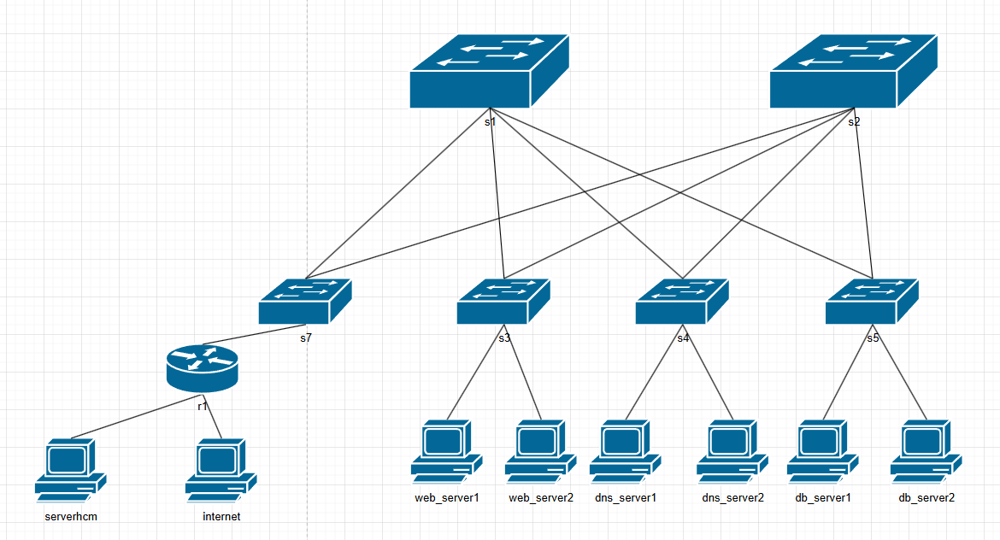

# Đồ án Mạng Máy Tính Nâng Cao - Zero Trust IPv6 Data Center

Dự án này hướng dẫn chi tiết cách xây dựng và giám sát một hệ thống Mạng Trung tâm Dữ liệu (Data Center) ảo hóa trên nền tảng **Mininet**. Toàn bộ cấu trúc được thiết kế theo tiêu chuẩn mạng Doanh nghiệp hiện đại: Lõi mạng chạy hoàn toàn bằng IPv6 (Native IPv6), định tuyến đa đường ECMP qua mô hình Spine-Leaf, tích hợp tường lửa bảo mật Zero Trust và hầm chuyển đổi NAT64 nhằm giao tiếp với thế giới IPv4 bên ngoài.

---

## 1. Mô tả Chi tiết Đề bài
Trong kỷ nguyên cạn kiệt địa chỉ IPv4, các Data Center lớn (như Google, Facebook) đều chuyển sang xây dựng cơ sở hạ tầng lõi bằng IPv6. Bài toán đặt ra là: Làm sao để một trung tâm dữ liệu hoàn toàn bằng IPv6 có thể bảo mật nội bộ tối đa, mà vẫn cung cấp dịch vụ ra mạng IPv4 toàn cầu cho người dùng bình thường?

Dự án này giải quyết trọn vẹn 4 bài toán cốt lõi:
1. **Kiến trúc Spine-Leaf (Định tuyến OSPFv3):** Xóa bỏ mô hình 3 lớp truyền thống (Core-Aggregation-Access) vốn hay bị thắt cổ chai. Thay vào đó, mạng được dàn phẳng thành 2 lớp: Spine (Tầng Xương sống) và Leaf (Tầng Nhánh). Để tận dụng 100% sức mạnh của nhiều đường cáp cáp quang nối chéo nhau, hệ thống dùng giao thức định tuyến OSPFv3 kết hợp thuật toán **ECMP (Equal-Cost Multi-Path)**, giúp "băm nhỏ" gói tin và truyền song song trên nhiều đường cùng lúc.
2. **Bảo mật Zero Trust (Micro-segmentation):** Dựa trên quan điểm "Không tin tưởng bất kỳ hệ thống nào kể cả máy chủ nội bộ". Mặc định, các cụm máy chủ Web, DNS, và Database sẽ bị dùng `ip6tables` bao bọc và **CẤM** giao tiếp ngang hàng với nhau. Chỉ các luồng dữ liệu hợp lệ (đã khai báo) mới được cấp phép đi qua, ngăn chặn triệt để hacker hay mã độc lây lan theo chiều ngang (East-West traffic) khi một máy chủ lỡ bị chiếm quyền.
3. **Gateway Trực Giao NAT64 (Tayga):** Các máy chủ nội bộ trong Data Center chỉ cài đặt IPv6 (Ví dụ: `fd00:10::1`), trong khi khách hàng ngoài Internet phần lớn vẫn dùng IPv4 (Ví dụ: `8.8.8.8`). NAT64 đóng vai trò như một "Cỗ máy thông dịch viên" ở cửa ngõ Router, tự động bọc gói tin IPv6 vào IPv4 và ngược lại. Kết hợp với Port Forwarding (Ánh xạ tĩnh), máy tính bên ngoài có thể gọi ngược vào Server bên trong trơn tru.
4. **Hệ thống Giám sát & Báo cáo Tự động (Telemetry):** Một phần mềm giao diện đồ họa (GUI) được viết bằng Python giúp thu thập số liệu băng thông, ping đo độ trễ, tự động vẽ biểu đồ khi đứt cáp rớt mạng, và xuất file Báo cáo phân tích cực kỳ trực quan.

---

## 2. Sơ đồ Mạng Logic (Topology)
Mô hình thực hành bao gồm 3 phân khu chính:
- **Tầng Lõi Spine (S1, S2):** Làm nhiệm vụ trung chuyển lưu lượng tốc độ cao siêu cấp. Đóng vai trò là cột sống của mạng lưới.
- **Tầng Nhánh Leaf (S3, S4, S5):** Kết nối trực tiếp xuống các máy chủ Server đầu cuối. Chịu trách nhiệm bảo mật Zero Trust.
- **Gateway & Mạng Internet (S7, R1):** R1 là Router Ranh giới (Border Router) chạy cấu hình thông dịch NAT64. Bên ngoài R1 là một dải mạng giả lập Public Internet thuần IPv4.


*(Hình ảnh minh họa kiến trúc toàn diện của Data Center)*

---

## 3. Quy trình Tổng quan Các Bước Cần Làm
Để làm lại từ đầu đồ án này, bạn sẽ trải qua quy trình logic sau:
1. **Chuẩn bị Môi trường:** Cài đặt HĐH Linux, cài Mininet, cài trình định tuyến FRRouting, cài Tayga (NAT).
2. **Kích hoạt Bản đồ Mạng:** Khởi chạy file `topology.py` để dựng lên các thiết bị ảo, thiết lập IP cho chúng và tự học OSPFv3.
3. **Bật Áo giáp Bảo vệ:** Khởi chạy tệp kịch bản Tường lửa `microsegment.sh` để phong tỏa nội bộ mạng.
4. **Mở Cửa Giao thương Internet:** Chạy kịch bản `nat_setup.sh` trên Router cửa ngõ để bắt đầu phiên dịch IP.
5. **Chứng Minh Kết Quả Bằng Đồ Thị:** Mở phần mềm `stats_tool.py` lên, tiến hành bơm tải Iperf và giả lập đứt cáp Spine để trình diễn kết quả ra các Biểu đồ Báo cáo Hình ảnh chuẩn kỹ sư.

---

## 4. Yêu cầu Các Thư viện & Hướng dẫn Cài đặt Cực kỳ Chi tiết

Dự án yêu cầu bắt buộc chạy trên Hệ điều hành Máy ảo Linux **Ubuntu (Khuyến nghị bản 20.04 LTS hoặc 22.04 LTS có Giao diện Desktop Đồ họa)**. Do can thiệp sâu vào Network Kernel, bạn cần sử dụng quyền `root` (lệnh sudo) cho toàn bộ tao tác cài đặt và vận hành.

### Bước 1: Cài đặt Nền tảng Mininet và Công cụ mạng cơ bản
Mininet là hệ thống nhân bản máy tính cực nhẹ, giúp tạo ra hàng chục Router và Switch ảo trong 1 giây:
```bash
sudo apt-get update
sudo apt-get install -y mininet net-tools xterm iperf iproute2 iptables
```

### Bước 2: Cài đặt Bộ não Định tuyến FRRouting (FRR)
FRR (Bản nâng cấp của phần mềm Quagga huyền thoại) sẽ hoạt động như "hệ điều hành định tuyến", biến các máy ảo Switch thành Router thực thụ, giúp chúng vẽ được bản đồ đường đi OSPFv3.
```bash
sudo apt-get install -y frr
```
**CẢNH BÁO LỖI - Cấu hình bắt buộc cho FRR:** 
Hệ thống FRR mặc định sẽ tịt ngòi, không thèm chạy IPv6 (OSPFv3) nếu bạn không vào file cấu hình bật nó lên. 
- Mở file cấu hình bằng trình soạn thảo Nano: `sudo nano /etc/frr/daemons`
- Dùng mũi tên di chuyển xuống, tìm dòng `ospf6d=no` và xóa chữ `no`, sửa nó thành `ospf6d=yes`.
- Bấm `Ctrl + O` để lưu, `Enter` để xác nhận, `Ctrl + X` để thoát.
- Gõ lệnh khởi động lại FRR để nó nhận não bộ mới: `sudo systemctl restart frr`

### Bước 3: Cài đặt Cỗ máy Dịch ngôn ngữ NAT64 (Tayga)
Tayga là một phần mềm tạo ra hầm NAT mạng ảo ở cửa ngõ, ép IP v6 chui vào vỏ IP v4.
```bash
sudo apt-get install -y tayga
```

### Bước 4: Cài đặt Ngôn ngữ Python 3 và Thư viện Vẽ Đồ thị
Để khởi chạy được Siêu Bảng Điều Khiển (Visual Dashboard) ở cuối bài, máy tính của bạn cần các công cụ vẽ toán học:
```bash
sudo apt-get install -y python3 python3-tk python3-pip
pip3 install matplotlib numpy
```

---

## 5. Tổng quan Hệ sinh thái Mã nguồn (Thư mục `source/`)

Trước khi bắt tay vào chạy, dưới đây là "Bản đồ kho báu" giải thích cặn kẽ ý nghĩa của từng File trong thư mục mã nguồn `source/` để bất kỳ ai cũng có thể hiểu rõ mỗi tệp đang đóng vai trò gì:

1. **`topology.py`**: **"Trái tim" của hệ thống**. Chứa mã nguồn Python khởi tạo cấu trúc bản đồ Mininet Spine-Leaf, rải IPv6 tự động, nạp cấu hình OSPFv3 cho FRR Router và nhúng các Siêu lệnh CLI tùy biến mà bạn sẽ gõ (acl, nat, failtest).
2. **`stats_tool.py`**: **"Con mắt" giám sát (Dashboard GUI)**. Ứng dụng giao diện đồ họa siêu đẹp. Nhiệm vụ: Theo dõi Băng thông (Throughput), Đo Ping (Latency), Bơm tải sinh lưu lượng giả ECMP ảo (Iperf) và Chụp ảnh Báo cáo Cuối kỳ.
3. **`microsegment.sh`**: **Script Tường Lửa Áo Giáp Zero Trust**. Không giao diện. Cất giấu hàng loạt bộ luật Tường lửa `ip6tables` cấm tiệt giao tiếp nội bộ Server. Chạy tự động ngầm khi bạn gõ lệnh `acl` trên Mininet.
4. **`nat_setup.sh`**: **Script Đào Hầm Xuyên Kẻ Phía Ngoài**. Nằm chờ lệnh bật Tayga NAT64 và IPv4 SNAT Masquerade. Chạy tự động ngầm khi bạn gõ lệnh `nat` để cấp mạng Internet IPv4 cho toàn Data Center IPv6.
5. **`failover_test.sh`**: **Kịch bản Khủng hoảng Đứt cáp**. Kịch bản khốc liệt chuyên bơm tải dồn dập, tự động đánh ngắt cáp Vật lý Spine `s1` và mô phỏng độ trễ sập mạng OSPF LSA 2.5s để vẽ Lỗ Hổng Đỏ vỡ tuyến y như đời thực. Chạy tự động ngầm khi gõ lệnh `failtest`.
6. **`draw_failover.py`**: **Bot Đồng Hành Vẽ Biểu Đồ Hội Tụ**. Hoạt động tự động ăn theo file đứt cáp bên trên. Chuyên đọc file Log rớt cáp (sau sự cố) để thả ra bức ảnh So sánh Thời gian Phục hồi 2 vạch Xanh-Đỏ `failover_chart.png`.
7. **`draw_topology.py`** & **`loadbalance_scenario.sh`**: File công cụ phụ họa. Dùng thư viện NetworkX vẽ sơ đồ và script bổ trợ nạp luồng ECMP nếu Giảng viên yêu cầu test tính năng phân rã kết nối phụ.

---

## 6. Hướng dẫn Vận hành Trực tiếp (Các File Trong Cặp `source/`)

Đầu tiên, bạn BẮT BUỘC phải đi vào đúng thư mục chứa các file mã nguồn:
```bash
cd source/
```

### 6.1. File Khởi Tạo Mạng Lõi: `topology.py`
Tệp này chứa toàn bộ hệ sinh thái của Đồ án. Rất đơn giản, hãy gõ lệnh:
```bash
sudo python3 topology.py
```
Ngay lập tức, màn hình sẽ tràn ngập các dòng Log khởi tạo thiết bị, gán IP tự động. Sau đó, nó tự động dừng lại và nhường quyền kiểm soát toàn mạng cho bạn tại **dấu nhắc lệnh của Mininet: `mininet> `**.

Đừng vội sử dụng lệnh ping thông thường, tôi đã "**độ lại**" hệ điều hành Mininet này để bạn có thể gõ các **Siêu Mã Lệnh (Custom Commands)** Cực kỳ VIP gõ tắt ngay tại dấu nhắc lệnh này:

* **Lệnh Quản Lý Bảo Mật:**
  * `mininet> acl` : Hệ thống sẽ tự động bóc file `microsegment.sh` ra cấu hình ngầm. Ngay lập tức, một mạng lưới Tường lửa Zero Trust được chăng ra. Các máy chủ (Web, DNS, DB) sẽ bị đứt liên lạc chéo, không thể lây virus cho nhau nữa. Nó bảo vệ Data Center tuyệt đối.
  * `mininet> dropacl` : Hạ vây Tường lửa xuống. Lệnh này xóa sạch các rule `ip6tables` vừa tạo, trả Data Center về một bản đồ dẹt bình thường (Cho phép Ping chéo thoải mái).
  
* **Lệnh Cửa Ngõ Internet:**
  * `mininet> nat` : Dựng hầm kết nối Tayga NAT64 lên (gọi ngầm `nat_setup.sh`). Lệnh này cấu hình Pool IP giả lập, cho phép Máy tính IPv6 bên trong (ví dụ Web Server) ping thẳng ra mạng IPv4 Internet (8.8.8.8) một cách thần kỳ!
  * `mininet> dropnat` : Đánh sập hầm, hủy cấu hình SNAT/DNAT, các máy chủ bên trong lại một lần nữa bị cô lập hoàn toàn, bặt vô âm tín với thế giới Internet bên ngoài.

* **Lệnh Đỉnh Cao Đồ Án (Test Sự cố Cáp):**
  * `mininet> failtest` : Khi bạn gõ lệnh này, một **Kịch bản Thảm họa Đứt cáp** (`failover_test.sh`) sẽ ra khơi. Bot tự động bắn Ping liên thanh, sau đó 4 giây nó sẽ **Giật đứt dây cáp mạng của Spine lõi s1**. Hệ thống OSPFv3 sẽ bị sốc, khựng mất mạng khoảng 2.5 giây để học lại đường đi, vội vã chuyển hướng thông xe cứu hộ qua nhánh Spine s2. 
  - Điều kỳ diệu nhất: Khi quá trình kết thúc, mã Python (`draw_failover.py`) lặn lội tự động phân tích độ gián đoạn Log và nhả ra một Tấm biểu đồ Cực Đẹp mang tên `failover_chart.png` lưu trực tiếp tại vị trí bạn đang đứng để bạn bê thẳng ảnh đó dán vào File Word Báo cáo!

---

### 6.2. File Siêu Bảng Điều Khiển Cân Bằng Tải: `stats_tool.py`

Hãy giữ nguyên bộ não đang chạy chữ `mininet>` ở cửa sổ Terminal thứ nhất đi (Đừng tắt nó). Bạn **MỞ THÊM MỘT CỬA SỔ TERMINAL THỨ HAI** (Mở New Tab) và cd vào `source` giống nãy, sau đó gõ lệnh gọi Bảng Điều khiển Đồ họa lên:
```bash
sudo python3 stats_tool.py
```
Một ứng dụng cửa sổ phần mềm rực rỡ hiển thị lên. Để một người hoàn toàn gà mờ cũng có thể tự dùng nó chứng minh thuật toán Cân bằng tải ECMP, hãy tập quen với các tính năng sau:

1. **Giám sát Throughput (Băng thông tải Data):** Chỗ **Nút Mạng (Node)** góc trái trên cùng, chọn Router `s1`. Kế bên Cột **Giao diện**, chọn cổng liên kết `s1-eth2`. Bạn đang xem mạch máu của tuyến cáp xương sống thứ nhất. Hãy tích vào dấu chấm tròn *Màn hình Băng thông Tải*. Đường biểu đồ Line màu Đỏ/Xanh sẽ vạch ra tốc độ Megabits/giây (Mbps) nhích theo thời gian thực như máy đo điện tâm đồ y tế!
2. **Theo dõi Ping Latency (Độ trễ RTT mili-giây):** Tích chọn thanh *Màn hình Đo Độ Trễ*. Hộp thoại "Nhắm Đích Ping" mọc lên và tự động "cày" rà soát Tường lửa. Nó sẽ liệt kê xem đường nào Bị cấm, đường nào được phép Ping. Trạm nào Ping qua được thì biểu đồ xanh dương sẽ nảy lên đo độ xịn của mạng.
3. **Mô phỏng Bơm Tải (Cỗ Máy Iperf Traffic Generator):** Nằm ở khung dưới cùng. Tuyến cáp nãy giờ đang rất tĩnh lặng (Bằng 0 Mbps). Hãy bơm cho mạng nổ ra: 
   - **Nguồn:** chọn `web_server1`.
   - **Đích:** chọn `db_server1` (hoặc chọc thẳng ra IP NAT64 `internet`). 
   - Ép mức Tốc độ là 500 Mbps. Nhấn nút **🔥 PHÓNG LƯU LƯỢNG**.
   - **KỊCH BẢN CHỨNG MINH ECMP:** Mắt nhìn ngay thẳng lên Biểu Đồ tốc độ. Một ngọn núi màu đỏ của Băng thông đâm sút màn hình. Vì bạn gõ 500Mbps, đồ thị tại máy `s1` sẽ nhảy đúng chạm ngưỡng ~250Mbps (Nó đã cưa đôi luồng dữ liệu). Bây giờ bạn đổi mục Nút mạng sang theo dõi Node `s2`, cổng `s2-eth2`, bạn sẽ thấy một ngọn núi băng thông y hệt cũng song song ở mức ~250Mbps! *Chúc mừng, bạn vừa chứng minh Mạng chia cưa đôi Băng thông ECMP thành công tuyệt đối!*
4. **Cỗ máy Giám Khảo Tự Động:** Nhấp vào nút xanh góc phải trên cùng (`📥 CHỤP REPORT/LOG ĐỒ ÁN`), phần mềm sẽ đứng im khoảng 3-5 giây. Nó đang tung bầy Ping đi quét tò mò toàn bộ ngóc ngách của Mininet, soi Tường lửa, Test băng tải rồi tự động xếp số liệu in ra **4 Tấm ảnh Báo cáo Tĩnh**. Vào ngay thư mục, bạn sẽ thu hoạch 4 bức ảnh Phân tích cực sâu, cực nét (`*_table.png`, `*_heatmap.png`) mang lên Thuyết trình.

---

## 7. Lời khuyên Xương Máu và Các Lỗi Thường Gặp (Rất Dễ Vấp)

1. **Quét Sạch Rác Ảo Mininet:** Sau một thời gian dài Thử nghiệm - Tắt Tool rồi lại Mở Tool hàng chục lần, Linux (đặc biệt là Ubuntu) sẽ hay lưu giữ các tiến trình mồ côi (Zombie Namespaces), khiến Port mạng bị kẹt cứng làm Mininet cấp lộn IP. **Bí kíp:** LUÔN LUÔN chạy lệnh Dọn Dẹp thần thánh sau khi bạn vừa bấm Thoát 1 lần chạy trước đó:
   ```bash
   sudo mn -c
   ```
   Lệnh này quét dọn sạch sành sanh mọi mớ hỗn độn mạng rác, trả lại cấu hình môi trường sạch bong như mới cài lại Windows!
2. **Quyền ROOT Không Thể Thiếu Cố:** Bạn có thể tự hỏi tại sao lệnh nào cũng bắt đầu bằng gõ `sudo`? Bởi vì việc Mininet cắt dây cấp IP Interface, tạo các Hầm ảo cho Tayga và việc tạo `tc qdisc` để mô phỏng Tắc cáp đều trực tiếp chạm đến nhân (Kernel) của hệ điều hành. Chạy các lệnh Python chay không có `sudo` sẽ khiến phần mềm văng Error tè le ngay lập tức. Đừng bao giờ quên nó.
3. **Không Xóa Cấu hình Các Node Ảo bằng Tay (`/var/run/netns/`):** Hãy để Mininet tự vận hành cấp phát, tuyệt đối không vào `ifconfig` để tự chỉnh sửa IP lung tung trên các Node vì định tuyến FRRouting được gắn chặt chẽ (Binding) theo chu kỳ file config tự biên dịch sẵn!
4. **Hiện Tượng Bị "Khớp" (Không Hiện Khung Giao Diện):** Nếu bạn cài Linux Core hoàn toàn bằng lệnh (Bản Ubuntu Server đen ngòm) hay kết nối thông qua SSH kiểu PuTTY, việc chạy `sudo python3 stats_tool.py` bắt buộc sinh ra Lỗi. Lý do ứng dụng này chạy bằng `Tkinter` (Vẽ đồ họa). Nó BẮT BUỘC cần môi trường Desktop GUI để chiếu cửa sổ lên. Nhàn nhất, hãy sử dụng Hệ điều hành **Ubuntu Desktop có Giao diện màn hình chuột đầy đủ** trên VirtualBox hay VMware!
